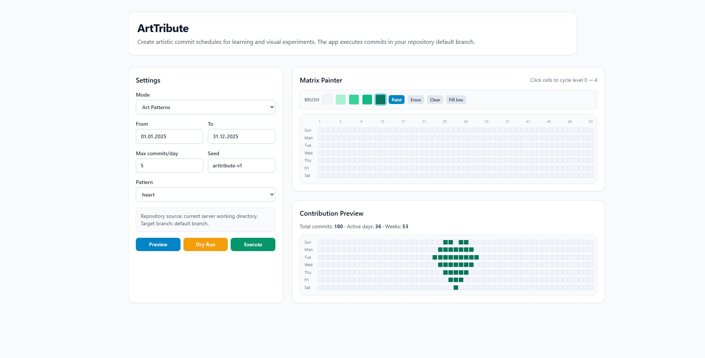

# ArtTribute



ArtTribute is a local creative utility for drawing and generating Git-style activity patterns.
It combines matrix painting and procedural generation (Perlin, Uniform, Gaussian, Worker 5/2, and Art presets) to create commit schedules for study and visualization.

> [!IMPORTANT]
> **Creative & educational disclaimer**
>
> ArtTribute is designed **only for learning, experimentation, and visual creativity**.
> It is **not intended** to falsify professional achievements, mislead recruiters, or fake credibility.
> You are fully responsible for your use of this project and for compliance with GitHub Terms of Service and applicable laws.

## What this project is

ArtTribute helps you:

- draw activity as a matrix,
- preview contribution-like heatmaps,
- generate commits on your repository default branch,
- experiment with different distribution models.

It runs locally with a web UI and Bun backend.

## Features

- Matrix painting by cells
- Perlin-based generation
- Uniform generation
- Gaussian generation
- Worker 5/2 generation with realistic variability
- Art preset generation
- Preview mode (no writes)
- Dry-run execution
- Real execution to repository default branch (`origin/HEAD` resolution with fallback)

## Quick start

```bash
bun install
bun run dev
```

- Frontend: `http://localhost:5173`
- API: `http://localhost:3001`

## How to use

1. Open the UI.
2. Choose a generation mode.
3. Set date range and parameters.
4. (Matrix mode) paint cells.
5. Click **Preview**.
6. Click **Dry Run** to validate.
7. Click **Execute** to create and push commits.

## Public vs private fork/repository setup

### Public fork flow

- Fork the source repository on GitHub.
- The fork is generally public if the source is public.
- Activity can be visible with repository context.

### Private setup flow (recommended for personal experiments)

For many accounts, a public repository cannot be forked as private directly.
A practical alternative is:

1. Create a new **private** repository in your account.
2. Clone it locally.
3. Copy/push the ArtTribute code into that private repository.
4. Run ArtTribute there.
5. Ensure your commit email is connected to your GitHub account.
6. Enable private contribution visibility in GitHub profile settings if needed.

### Key differences

- **Public fork/repo**: transparent repository context.
- **Private repo**: private code visibility; profile contribution visibility depends on GitHub settings.

## Safety notes

- The server uses the current working directory as the repository.
- Execution writes commits and pushes to remote.
- Test in a sandbox repository before using on important repositories.
